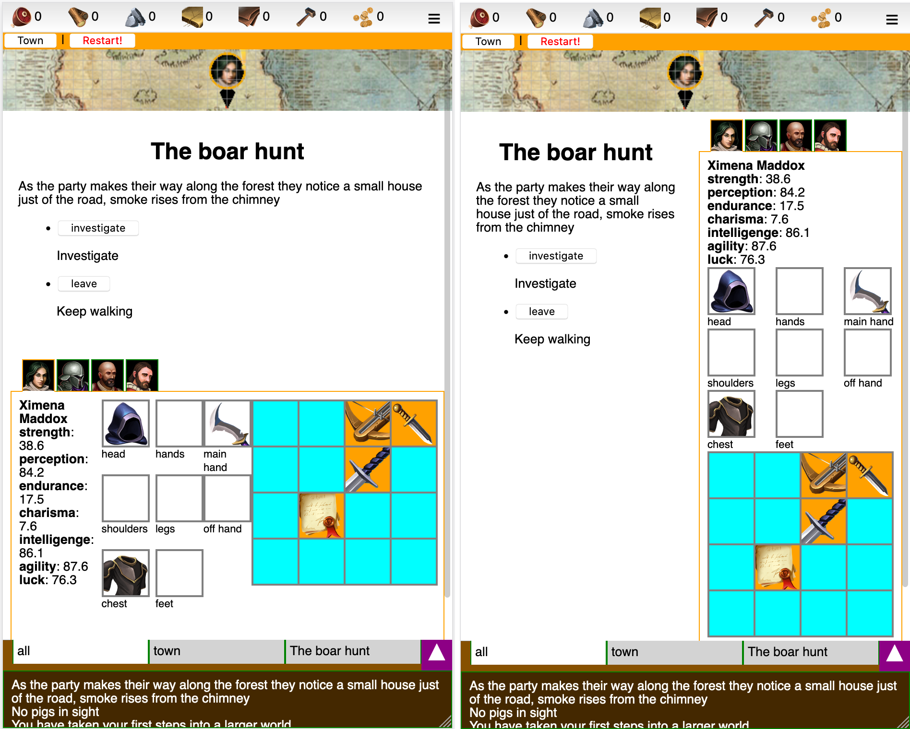

backlog of ideas

#### 27/4/2019 LOG
[x] display a log on the lower part of the screen.
    each log entry has a type: (common, quest, warning)
    can be plain text now. 
[x] later to be replaced by keys that
    can be filtered (will be filtered default on the quest when a quest is clicked)
[x] Quest logs are added to this log
[x] for ease, a party can only exist when a quest is combined with a group of adventurers
    its not possible to create a party and send them on a quest later
    the party gets created when the adventurers leave on the quest
[-] the quest has an icon, that will be the icon for the party too
[x] the quest icon will be the leader of the party


#### 27/4/2019 Multi lingual support (i18n)
[x] for multi lingual support we need a templating engine
    it needs to support dynamic lookups. such as
    "you found a {item.name:sword}"
    but also:
    "you found a {item.name:{context:item}}"
    where we provide a context object { item: sword }
[x] compile the templates and store them by key
[x] allow for precompilation and JIT, pass by ctor, default = true


#### 28/4/2019
[x] display multi langual structure
[x] display multi langual resources
[x] for simplicity, don't change the names of the structures as they level up
[x] add 'unique' optional prop to item
[ ] add 'articleDefined', 'articleUndefined' optional props to item
[ ] add 'common-article-defined': 'the', 'common-article-undefined': 'a' to language file
[ ] add helper for article, undefined, defined and auto. investigate if we can do this: "item foundItem aA", "item foundItem aU" etc
    will see if 'articleDefined' or 'articleUndefined' is declared, if not, will use 'common-article..'
    auto will investigate the 'unique' property. if true use defined, otherwise undefined
[x] have a helper for 'capital' Capitalise


#### 28/04/2019 Tavern [+design]
[x] The tavern has a limited number of vacancies (rooms). Upgrading the tavern upgrades this number.
[ ] Periodically new adventurers will take residence
    The tavern will only accept new adventurers when there are rooms free.
    Adventurers on quests keep their rooms
[ ] You can kick out an adventurer that's not on a quest. Freeing the room. 
[x] Quests are launched from the 'quest board' in the tavern. 
[ ] You can train workers/citizens to become adventurers


#### 02/05/2019 TRAITS [+design]
[ ] During encounters, characters can receive certain traits. These can be beneficial or not. 
[ ] In some cases the traits can be healed, removed etc. 
[ ] Some items can be used to grant a trait to an adventurer.


#### 23/06/2019 HELP
[ ] Each screen should get a contexualized help window
[ ] HTML elements can receive a 'data-help' attribute with a key to refer to the localisation file


#### 07/07/2019 STRUCTURE UPGRADE TIME [+design]
[ ] Upgrading a structure takes time


#### 07/07/2019 GAME DESIGN: warehouse [+design]
[ ] Is the warehouse limited? Can you add unlimited items?
[x] Resource capacity is limited
[ ] Warehouse produces 'food rations' for quests


#### 10/07/2019 ASSERTS [+tech]
[ ] Include an assert library


#### 10/07/2019 GAME TICK RESOURCE [+tech]
[x] Move gameTick from quest reducer into 'controllers'
[x] Move add resource into 'controllers'
[ ] Move the guard around maxResources to the reducer (but it needs access to the level of the warehouse to determine maxresources)
    https://stackoverflow.com/questions/34333979/accessing-other-parts-of-the-state-when-using-combined-reducers


#### 10/07/2019 GAME DESIGN: minimum workers on item craft
[ ] Perhaps each item can have a number of minimum workers?


#### 12/07/2019 quest prerequisites/ resource sink [+design]
[ ] The quests should have some sort of resource cost. 
    However we don't want weapons to break all the time.
    Are the items consumed straight away?
    Ideas:
[ ] Sharp weapons can get more dull if used more. Dull blades do way less damage. Craft whetstones from stone and use on the weapon to sharpen again.
[ ] Weapons slowly lose durability (/health) when used. 
[ ] Weapons can either be repaired ?  OR : just disassembled for a fraction of the crafting cost


#### 13/07/2019 EQUIPMENT REQUIREMENTS
[ ] Equipment (=apparel+weapons) can have stats requirements (e.g. a minimum amount of STR)


#### 14/07/2019 ROUTER
[x] Implement react router for town/world
[x] Implement react router for structures
[x] Can go to resource production structure directly from warehouse

#### 14/07/2019 XP Progression 
[ ] https://stackoverflow.com/questions/6954874/php-game-formula-to-calculate-a-level-based-on-exp
[ ] or find RPG framework
[ ] XP should have diminishing returns on weaker enemies
    research: wow?

#### 14/07/2019 Rooms of tavern
[x] figure out how amount of rooms is determined. perhaps by level?

#### 15/07/2019 GAME DESIGN: Party speed [+design]
[ ] The speed in which the party progresses in a quest could be determined by the party itself. Perhaps the slowest member?

#### 15/07/2019: host on github? [+tech]
[x] Maybe I can host this stuff on github pages. (https://github.com/gitname/react-gh-pages)
[x] Probably best to start a new `create-react-app`.

#### 20/07/2019 contextual popup
[x] the contextual info should just pop up over the item that you have clicked


#### 20/07/2019 open popups
[x] popups can be opened using withAppContext


#### 20/07/2019 quest view
[x] shows latest log message when not in encounter


#### 22/07/2019 Objectives
[ ] we could have objectives as a type of achievement / tutorial kinda thing. players would learn about the game
    and get rewarded when they complete an objective


#### 23/06/2019 POPUPS CAN FLIP
[x] popups should try to position themselves and if there is no space, flip

#### 24/06/2019 BUTTON COMPONENTS
[ ] buttons should get their own react component.
[ ] first identify the different button types

#### 25/07/2019 SCROLLING TABS
[ ] Tabbar could be scrollable
[ ] Scrollbar should be on top
    https://stackoverflow.com/questions/18997724/how-to-change-scroll-bar-position-with-css

#### 25/07/2019 CUSTOM CURSORS [+tech]
[ ] We need cursors for move inventory item and not-allowed
[x] Need cursors in pixi context. Why isn't it working? (https://codesandbox.io/s/autumn-waterfall-ng6gb)
    https://pixijs.io/examples/#/interaction/custom-mouse-icon.js
    Fixed! Path needed {process.env.PUBLIC_URL}

#### 29/07/2019 EQUIP GEAR
[x] Can equip gear from the players inventory
[x] Can equip gear from the warehouse

  head                hands
  shoulders            legs
  chest                feet
  mainhand  offhand sidearm

#### 31/07/2019 THREE.js
Because I'm not an artist and I want to use unity3d assets
[x] First check if components dont get remounted too much. If yes, find out why and resolve issue!     
[ ] Find cool fantasy town assets
[x] Check if can be loaded in threejs (seperate project)
[-] Implement in town
[-] It would be cool to have the town scrollable. (see: 23/08/2019 WORLD MAP)
    The easiest way would maybe to be to create a very long canvas, render everything on it and let the browser scroll this canvas. This way you also have a scrollbar.
    Not optimal for performance tho.
[ ] Find cool fantasy character unity asset packs
[x] Check if can be loaded in threejs (seperate project)
[-] Implement in combat
    perhaps we don't need react bindings.
    See if we can do this:
    1. on mount, all actors are spawned and positioned
    2. on update, all actors (AIs turn happens simultanously?) move to their new positions
       and play their animations.
[x] On second hand, I think it's worth checking out react-three-fiber. Might get complicated otherwise  


#### 04/08/2019 Swap items between warehouse and adventurers [+tech]
[x] Take items from warehouse and assign to adventurer inventory
[x] Take items from warehouse and assign to adventurer gear

#### 08/08/2019 Combat [+design] [+tech]
Still haven't figured out a combat game system. But can implement some ground work. 
Want to store the combat state in the store as such:
```
combat: {
    actors: [{
        allegiance: "player|enemy",
        location: [2,1],
        health: 10,
        actionPoints: 3,
    }],
    turn: "player",
    action: {
        type: "move|shoot|..."
        actor: "actorId",
        target: { location: [6,3] }
        actionEndsAt: time
    }
}
```

During combat each actor has a nr of AP. They can spend this in a few ways:

- MOVE ( forward 1 AP, backward 2 AP, sidewards 2 AP)
- TURN (1 AP)
- USE WEAPON (depends on weapon type, ex:
        * sword: thrust*, slash
        * dgger: thrust*, cut
        * spear: thrust*, throw
        * bow:   aim, fire)
- SWITCH (main/sidearm)
- CHANGE stance (kneeling, standing)
- SHIELD UP (lowers chance to hit with weapon)
- JUMP over obstabcles?
- USE inventory items?

*) thrusting does more damage than regular attack but leaves an actor 'overextended', meaning they can't parry or dodge.


! In general, ranged does less dmg than melee but is often safer.

research: different weapon types and their strenghts and weaknesses

[ ] body area hit could be stochastic now:
    - head:  0.1
    - torso: 0.4
    - hands: 0.1
    - legs:  0.3
    - feet:  0.1
[ ] later allow for aimed hits

COMBAT SEQUENCE

[ ] When attacking, first roll to hit. Weapon skill determines hit or miss. For ranged, a distance penalty applies. Also cover bonus can be in effect.
[ ] research: how does weapon skill work? does it include STR?
    can it increasy by time?
    let's assume for now we fix it to a value

[ ] Defender rolls to dodge. Dodge% is in effect at equal level. Otherwise penalty applies, eg 10% per level difference

[ ] If dodge fails can try to block with shield or parry with weapon. IF succesful will deflect all dmg but cause shield/weapon integrity to go down.

[ ] If not blocked or parried, part of damage is absorbed by armour (if the actor is wearing any).
   A helmet with armour rating 20 absorbs 20 dmg of each hit.
[ ] Armours integrity goes down. In general more than if would be blocked or parried.

EFFECTS
in combat these effects should be checked all the time, they are modifiers for various things

```
enum EffectType { attack, passive, ... }
enum EffectResultType { fireDamage, ... }

interface Effect {
    effectType: EffectType,
    condition?: (source, target, combat) => boolean,
    resultType: EffectResultType,
    value: any (can be function)
    duration?: number,
    charges?: number
}
```

eg: "+20 fire dmg to undead" {
  effectType: attack,
  condition: (source, target, combat) => target.race == undead
  resultType: fireDmg
  value: 20
}

We can render game as ascii art for now using a PRE tag

[ ] Some tiles on the combat map offer cover. Cover works in all directions.

23/8/2019 ADVENTURER STATS

base and (secondary stats) are:
- STRength (melee attack)
- STAmina (carry, hitpoints)
- AGIlity (dodge, amount of AP)
- INTelligence (perception?)

[x] todo: find GURPS basic set: characters

[ ] each weapon / armour has a STR requirement
[ ] shields and weapons have a integrity property (1-0) when it reaches 0 it breaks

#### 23/08/2019 WORLD MAP
[x] World map is paneable by dragging. Can feature a compass that always points to the town
[x] Research: three.js controls (https://threejs.org/examples/misc_controls_map.html)
    http://danni-three.blogspot.com/2013/09/threejs-heightmaps.html


#### 23/08/2019 THEME [+art] [+design]
todo: figure out a cool theme,
research fantasy concept art


#### 24/08/2019 NAMING
[x] come up with a better name for worn equipment, (perhaps 'apparel')
[x] refactor into the following structure: 
    EQUIPMENT = { APPAREL, WEAPONS }


#### 17/11/2019 STORE WORLD POS
(obsolete)
[-] store world pos in redux, pass to WorldMap.scrollToPosition
[-] read: Three.js projecting mouse clicks to a 3D scene - how to do it and how it works
          https://barkofthebyte.azurewebsites.net/post/2014/05/05/three-js-projecting-mouse-clicks-to-a-3d-scene-how-to-do-it-and-how-it-works


#### 17/11/2019 ANIMATIONS
(obsolete)
Creating animated glTF Characters with Mixamo and Blender https://www.donmccurdy.com/2017/11/06/creating-animated-gltf-characters-with-mixamo-and-blender/

#### THREEJS examples (MIGHT IS RIGHT):
[ ] http://server1.lazy-kitty.com/tests/
[x]   check achievements (http://server1.lazy-kitty.com/tests/achievements_2019_08_11/)
    
24/11/2019 Terrain generator
(obsolete)
[-] uses height-map images (grey-scale) https://github.com/Usnul/meep

#### 26/11/2019 Smoke particles from the houses in world map
[-] https://aerotwist.com/tutorials/creating-particles-with-three-js/
[x] https://codepen.io/inlet/pen/feddc8fa71e3b5afc6c3e4eda9cc83df


#### 02/12/2019 Resource update 
[ ] should happen at a set interval instead of every game tick

#### 10/12/2019 Item warehouse > adventurer
[ ] Can drop items from warehouse onto adventurer    


#### 01/01/2020 rerender of world [+tech]
[x] Figure out why the world gets rerendered on state change of App
    it's because of react-router and the `component` prop on `<Route>`. with `render` prop it doesn't re-render!


#### 28/03/2020 Pixi-js [+art], [+tech]
[x] Screw 3d its way too complicated. Going to try pixi-js

#### 30/03/2020 Structure in town popup [+tech]
[x] Town should store location
[-] Structures in town should display a short popup on click. The popup should have a button to expand the GUI and show all the details
[x] Instead we have a legenda


#### 30/03/2020 Mobile [+art], [+tech]
[ ] Need to completely check if the app is responsive and works in mobile

#### 30/03/2020 Leaders [+design]
[ ] Parties can have a leader. The leader provides the icon for the party. What else does it mean?
[ ] Leader ability?


#### 30/03/2020 Combat situation visuals [+art], [+tech]
[x] See https://github.com/knervous/tiled-pixi-react
    I have cloned this repo. Will try to move some code over


#### 30/03/2020 Refactor react [+tech]
[ ] Refactor react, remove containers. Implement useSelector hook
[ ] Check for needless rerendering
[ ] Move Windows into own component and use WindowManager


#### 01/04/2020 Draw quest path [+art]
[x] Would be cool to see the path that a party took
    https://stackoverflow.com/questions/7054272/how-to-draw-smooth-curve-through-n-points-using-javascript-html5-canvas
[ ] Best would be to have a dotted line..    


#### 02/04/2020 Toasts [+tech]
[x] Basic toast implementation is done
[x] Implement in different scenarios (quest complete, quest failed, achievement unlocked)
[x] Implement for item craft complete
[x] Can click quest toasts to open quest. See (29/04/2020)
[ ] Add sound


#### 02/04/2020 Make town come alive [+art]
[x] Add animations
[x] Add particle effects (fire, smoke)


#### 02/04/2020 Cool smoke shader [+art]
[ ] Can use this in some sort of menu or loader?
    https://codepen.io/davidhartley/pen/seEki


#### 02/04/2020 Remove preloader [+ref]
[ ] Remove preloader
    Preloading is not needed for images.
[ ] Figure out if needed for sound?
[ ] If needed, preloader for pixi can be implemented as such
    https://www.youtube.com/watch?v=KwVszq2RjX4


#### 03/04/2020 Make Inventory Responsive Again (MIRA [+tech]
nr of columns is determined by screen size (media queries)
[ ] medium width


#### 03/04/2020 Structure views have a banner [+art]
[x] It should show the interior of the structure, what's happening there

#### 04/04/2020 Hit area in townview [+tech]
[x] https://github.com/explooosion/hitarea-shapes
[x] Physics editors: https://loonride.com/tools/physics


#### 06/04/2020 Quest editor [+tech]
An editor that could help in designing quests on the world map. Draws a list of nodes


#### 06/04/2020 Encounter indicator in map marker [+tech], [+art]
Map marker needs to show there is an encounter going on. 
[x] Maybe exclamation mark? 


#### 10/10/2020 Make structureviews responsive 
[ ] Tavern
[ ] Warehouse


#### 10/10/2020 Make legenda for town 
[x] Clicking on it will scroll the structure into view and after brief delay, open window


#### 10/04/2020 Oracle, Encounters? [+tech]
Should think about what to do with the oracle. Maybe refactor the whole thing
In any case I have decided to change the way encounters work. I'm going to leave the idea of text-adventure based stuff
and do everything in the 'combat map'. However when out of combat, In addition, every encounter has one ore more multiple scenes (they are like rooms). 
The party can freely move between these scenes and sometimes a scene change is forced.

[x] I have implemented a lowlevel way with shaders and a Mesh to display the encounter map.
    However it's not sufficient. It doesnt work well on mobile, it doesn't support animations and there's 
    a problem receiving events. 

    So I think the best recourse is to go with pixi tilemap

[x] Implement pixi-tilemap in react-pixi (check https://github.com/Alan01252/pixi-tilemap-tutorial)
also: https://pixijs.io/pixi-tilemap/demo/main.js
[x] First read and parse the json file
https://github.com/pixijs/pixi-tilemap/issues/76#issuecomment-590104857
https://github.com/pixijs/pixi-tilemap/blob/master/basic/atlas.json
https://gamedev.stackexchange.com/questions/115982/industry-standard-json-formats-for-game-assets

[-] Implement tmx loader (see tiled-pixi-react: https://www.npmjs.com/package/tiled-pixi-react)
    (no. use json!)

[x] Shit. pixi-tilemap doesn't export as npm module.    

The static part of the scene is not stored in store. The dynamic part is created by Oracle.createSceneState() and stored in redux. After that, any changes (actors moving, stuff getting added/removed) are also persisted to redux.

#### 11/10/2020 QuestPanel vertical [+art]
Because the QuestPanel will be showing the sceneview it makes more sense to have a vertical layout where everything is stacked underneath each other.

_(left = vertical, right = horizontal)_
[x] I've implemented an 'auto' mode that shows a horizontal layout in medium screens and a vertical layout in small screens.

In general we should design in such a way that if content doesnt fit on the screen there is vertical scroll.

#### 12/10/2020 Interaction in scenes [+tech]
For interaction in the scene I want to develop a sort of system where you first click an adventurer to select it. Then underneath one to three buttons appear, [move, attack, interact], move is selected by default. 

Then there are two options:
[x] Dragging to a tile, shows a red/green line between destination and adventurer
[x] Clicking on a tile

Currently favouring dragging, because we can use it in combat and show the AP cost 

#### animations
https://github.com/DragonBones/DragonBonesJS

#### 29/04/2020 Font [+art]
[x] Implement 'gabriella' font

#### 29/04/2020 Route to quest [+tech]
[x] So we can open a quest from anywhere, e.g toasts

#### 08/05/2020 Sass
[ ] Try to implement sass again (https://www.google.com/search?q=sass+create+react+app)

#### Item rarity [+art] [+design]
[ ] background on items. gray = common, green = uncommon, blue = rare, purple = epic, orange = legendary

#### Remove unused or little used packages 
[ ] momentjs is 231.7kb and hardly used. refactor
[x] tmx-parser

#### Tiled manual [+doc]
[ ] Write a list of all the tiled stuff, object name, type, props that have some effect on the game
  
    type: "exit"
    Exit the scene. If a property called `loadScene: string` is present, will load that scene. If not, the encounter will be exited

### Loot caches
[ ] Implement dragging
[ ] Implement dragging
[ ] Implement dragging