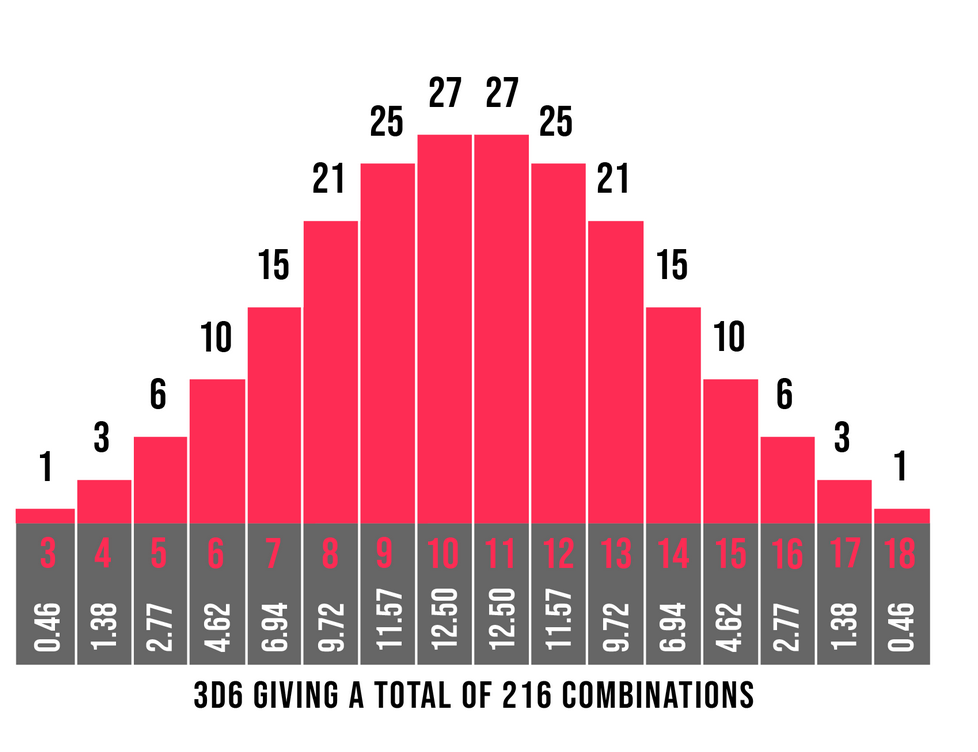
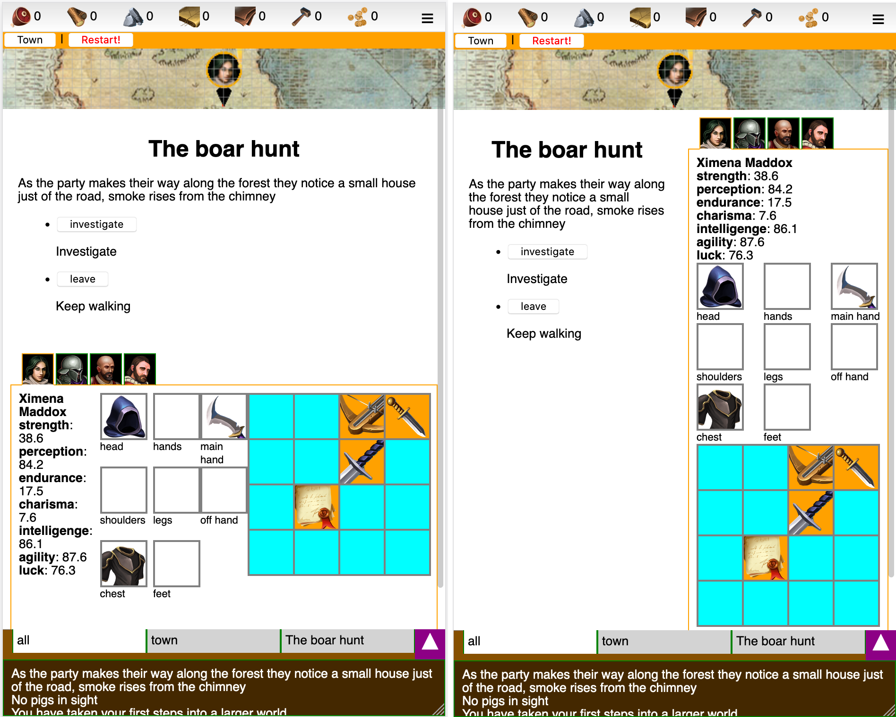

# backlog of ideas

#### 27/4/2019 LOG
- [x] display a log on the lower part of the screen.
    each log entry has a type: (common, quest, warning)
    can be plain text now. 
- [x] later to be replaced by keys that
    can be filtered (will be filtered default on the quest when a quest is clicked)
- [x] Quest logs are added to this log
- [x] for ease, a party can only exist when a quest is combined with a group of adventurers
    its not possible to create a party and send them on a quest later
    the party gets created when the adventurers leave on the quest
- [x] the quest has an icon, that will be the icon for the party too
- [x] the quest icon will be the leader of the party


#### 27/4/2019 Multi lingual support (i18n)
- [x] for multi lingual support we need a templating engine
    it needs to support dynamic lookups. such as
    "you found a {item.name:sword}"
    but also:
    "you found a {item.name:{context:item}}"
    where we provide a context object { item: sword }
- [x] compile the templates and store them by key
- [x] allow for precompilation and JIT, pass by ctor, default = true


#### 28/4/2019 Various stuff
- [x] display multi langual structure
- [x] display multi langual resources
- [x] for simplicity, don't change the names of the structures as they level up
- [x] add 'unique' optional prop to item
- [ ] add 'articleDefined', 'articleUndefined' optional props to item
- [ ] add 'common-article-defined': 'the', 'common-article-undefined': 'a' to language file
- [ ] add helper for article, undefined, defined and auto. investigate if we can do this: "item foundItem aA", "item foundItem aU" etc
    will see if 'articleDefined' or 'articleUndefined' is declared, if not, will use 'common-article..'
    auto will investigate the 'unique' property. if true use defined, otherwise undefined
- [x] have a helper for 'capital' Capitalise


#### 28/04/2019 Tavern and quests [+design]
- [x] The tavern has a limited number of vacancies (rooms). Upgrading the tavern upgrades this number.
- [ ] Periodically new adventurers will take residence
    The tavern will only accept new adventurers when there are rooms free.
    Adventurers on quests keep their rooms
- [ ] You can kick out an adventurer that's not on a quest. Freeing the room. 
- [x] Quests are launched from the 'quest board' in the tavern. 
- [ ] You can train workers/citizens to become adventurers
- [ ] Quest maps are non-linear, use a hub-and-spoke design
- [ ] Quests can be repeated indefinitely


#### 02/05/2019 Traits [+design]
- [ ] During encounters, characters can receive certain traits. These can be beneficial or not. 
- [ ] In some cases the traits can be healed, removed etc. 
- [ ] Some items can be used to grant a trait to an adventurer.
- [ ] Some items can be used to grant a trait to an adventurer.
- [ ] Maybe there can be permanent traits and mutable traits? Should we differentiate between the two?
- [x] Create trait enum list 
- [x] Create trait definition file
- [x] UX: Clicking on a trait opens a context info popup showing name and lore text.
    Trait name and lore text is a composed translation key. 
    when hasEffect bool is true, show effect text  
- [ ] To grind specific gear for specific adventurers (instead of min-maxing the same best gear on all chars)
    some gear can only be used by specific traits. Or set bonusses and effects can only apply to specific traits. 
    This because our adventurers have no class. (lol)
- [ ] Examples: 
    "arrow finder": When looting a body has a chance to find arrows 
    "gloomy": will sometimes say depressing things
    “"Life isn't fair and the universe is blind to our suffering”

“Life is meaningless and without hope”
“Love is nothing more than chemical reactions”
“Please kill me and end my suffering”
“Humanity is as cruel as it is shortsighted”
“Do you ever find yourself wandering in the broken remnants of your own life”
“There’s death all around us. Everywhere we look. ”
“What is this sadness that pierces my heart?”

#### 23/06/2019 HELP
- [ ] Each screen should get a contexualized help window
- [ ] HTML elements can receive a 'data-help' attribute with a key to refer to the localisation file


#### 07/07/2019 STRUCTURE UPGRADE TIME [+design]
- [x] Upgrading a structure takes time


#### 07/07/2019 GAME DESIGN: warehouse [+design]
- [ ] Is the warehouse limited? Can you add unlimited items?
- [x] Resource capacity is limited
- [ ] Warehouse produces 'food rations' for quests
- [x] Cant take item from equipment guy and drop on inventory 

#### 10/07/2019 ASSERTS [+tech]
~~- [x] Include an assert library~~


#### 10/07/2019 GAME TICK RESOURCE [+tech]
- [x] Move gameTick from quest reducer into 'controllers'
- [x] Move add resource into 'controllers'
- [x] Move the guard around maxResources to the reducer (but it needs access to the level of the warehouse to determine maxresources)
    https://stackoverflow.com/questions/34333979/accessing-other-parts-of-the-state-when-using-combined-reducers


#### 10/07/2019 GAME DESIGN: minimum workers on item craft
- [ ] Perhaps each item can have a number of minimum workers?


#### 12/07/2019 quest prerequisites/ resource sink [+design]
- [ ] The quests should have some sort of resource cost. 
    However we don't want weapons to break all the time.
    Are the items consumed straight away?
    Ideas:
- [ ] Sharp weapons can get more dull if used more. Dull blades do way less damage. Craft whetstones from stone and use on the weapon to sharpen again.
- [ ] Weapons slowly lose durability (/health) when used. 
- [ ] Weapons can either be repaired ?  OR : just disassembled for a fraction of the crafting cost


### weapons
https://forum.rpg.net/index.php?threads/what-are-the-advantages-if-these-various-medieval-weapons-armor.734562/

#### 13/07/2019 EQUIPMENT REQUIREMENTS
- [ ] Equipment (=apparel+weapons) can have stats requirements (e.g. a minimum amount of STR)


#### 14/07/2019 Router [+tech]
- [x] Implement react router for town/world
- [x] Implement react router for structures
- [x] Can go to resource production structure directly from warehouse

#### 14/07/2019 XP Progression 
- [z] https://stackoverflow.com/questions/6954874/php-game-formula-to-calculate-a-level-based-on-exp
- [ ] or find RPG framework
    level = 0.5 * Math.sqrt(xp)
    
- [ ] XP should have diminishing returns on weaker enemies
    research: wow?
- [x] Action points come with level, use logarithmic scale:

for (var i = 0; i < 30; i++) {
 console.lg(i + ":" + Math.floor(Math.log(i+1)*1))
}

#### 14/07/2019 Rooms of tavern
- [x] figure out how amount of rooms is determined. perhaps by level?

#### 15/07/2019 GAME DESIGN: Party speed [+design]
- [ ] The speed in which the party progresses in a quest could be determined by the party itself. Perhaps the slowest member?

#### 15/07/2019: host on github? [+tech]
- [x] Maybe I can host this stuff on github pages. (https://github.com/gitname/react-gh-pages)
- [x] Probably best to start a new `create-react-app`.

#### 20/07/2019 contextual popup
- [x] the contextual info should just pop up over the item that you have clicked


#### 20/07/2019 open popups
- [x] popups can be opened using withAppContext


#### 20/07/2019 quest view
- [x] shows latest log message when not in encounter


#### 22/07/2019 Objectives
- [ ] we could have objectives as a type of achievement / tutorial kinda thing. players would learn about the game
    and get rewarded when they complete an objective


#### 23/06/2019 POPUPS CAN FLIP
- [x] popups should try to position themselves and if there is no space, flip

#### 24/06/2019 BUTTON COMPONENTS
- [x] buttons should get their own react component.
- [x] first identify the different button types
- [x] https://www.youtube.com/watch?v=ftINEEKWtFQ

#### 25/07/2019 SCROLLING TABS
- [ ] Tabbar could be scrollable
- [ ] Scrollbar should be on top
    https://stackoverflow.com/questions/18997724/how-to-change-scroll-bar-position-with-css

#### 25/07/2019 CUSTOM CURSORS [+tech]
- [ ] We need cursors for move inventory item and not-allowed
- [x] Need cursors in pixi context. Why isn't it working? (https://codesandbox.io/s/autumn-waterfall-ng6gb)
    https://pixijs.io/examples/#/interaction/custom-mouse-icon.js
    Fixed! Path needed {process.env.PUBLIC_URL} 

#### 2019-07-29 EQUIP GEAR
- [x] Can equip gear from the players inventory
- [x] Can equip gear from the warehouse

  head                hands
  shoulders            legs
  chest                feet
  mainhand  offhand sidearm

#### 2019-07-31 THREE.js
~~
Because I'm not an artist and I want to use unity3d assets
- [x] First check if components dont get remounted too much. If yes, find out why and resolve issue!     
- [x] Find cool fantasy town assets
- [x] Check if can be loaded in threejs (seperate project)
- [x] Implement in town
- [x] It would be cool to have the town scrollable. (see: 23/08/2019 WORLD MAP)
    The easiest way would maybe to be to create a very long canvas, render everything on it and let the browser scroll this canvas. This way you also have a scrollbar.
    Not optimal for performance tho.
- [x] Find cool fantasy character unity asset packs
- [x] Check if can be loaded in threejs (seperate project)
- [x] Implement in combat
    perhaps we don't need react bindings.
    See if we can do this:
    1. on mount, all actors are spawned and positioned
    2. on update, all actors (AIs turn happens simultanously?) move to their new positions
       and play their animations.
- [x] On second hand, I think it's worth checking out react-three-fiber. Might get complicated otherwise  
~~

#### 04/08/2019 Swap items between warehouse and adventurers [+tech]
- [x] Take items from warehouse and assign to adventurer inventory
- [x] Take items from warehouse and assign to adventurer gear

#### 08/08/2019  Combat [+design] [+tech]
Still haven't figured out a combat game system. But can implement some ground work. 
Want to store the combat state in the store as such:

```
combat: {
    actors: [{
        allegiance: "player|enemy",
        location: [2,1],
        health: 10,
        actionPoints: 3,
    }],
    turn: "player",
    action: {
        type: "move|shoot|..."
        actor: "actorId",
        target: { location: [6,3] }
        actionEndsAt: time
    }
}
```

During combat each actor has a nr of AP. They can spend this in a few ways:

- MOVE ( forward 1 AP, backward 2 AP, sidewards 2 AP)
- TURN (1 AP)
- USE WEAPON (depends on weapon type, ex:
        * sword: thrust*, slash
        * dgger: thrust*, cut
        * spear: thrust*, throw
        * bow:   aim, fire)
- SWITCH (main/sidearm)
- CHANGE stance (kneeling, standing)
- SHIELD UP (lowers chance to hit with weapon)
- JUMP over obstabcles?
- USE inventory items?

*) thrusting does more damage than regular attack but leaves an actor 'overextended', meaning they can't parry or dodge.


! In general, ranged does less dmg than melee but is often safer.

research: different weapon types and their strenghts and weaknesses

- [ ] body area hit could be stochastic now:
  - head:      0.1
  - torso:     0.4
  - hands:     0.1
  - legs:      0.3
  - shoulders: 0.05 
  - feet:      0.05
- [ ] later allow for aimed hits

COMBAT SEQUENCE

See [GURPS Combat Example (Basic)](https://www.youtube.com/watch?v=-G0l_n9rEYk)
https://www.youtube.com/watch?v=LO8BHmnIrVU
- [x] When attacking, first roll to hit. Weapon skill determines hit or miss. For ranged, a distance penalty applies. Also cover bonus can be in effect.
- [x] research: how does weapon skill work? does it include STR?
    can it increasy by time?
    Weapon skill could be a skill that can be levelled up, but it would have to be rare
    let's assume for now we fix it to a value
- [x] When slashing, look at weapon type. Then take associated weapon skill.
    Roll 3d6 and if result is higher than weapon skill, it's a miss

- [x] Defender rolls to dodge. Dodge% is in effect at equal level. 
- [ ] Otherwise penalty applies, eg 10% per level difference

- [ ] If dodge fails can try to block with shield or parry with weapon. IF succesful will deflect all dmg but cause shield/weapon integrity to go down.

- [ ] If not blocked or parried, part of damage is mitigated by armour (if the actor is wearing any).
   A helmet with armour rating 20 absorbs 20 dmg of each hit.
- [ ] Armours integrity goes down. In general more than if would be blocked or parried.

EFFECTS
in combat these effects should be checked all the time, they are modifiers for various things

```
enum EffectType { attack, passive, ... }
enum EffectResultType { fireDamage, ... }

interface Effect {
    effectType: EffectType,
    condition?: (source, target, combat) => boolean,
    resultType: EffectResultType,
    value: any (can be function)
    duration?: number,
    charges?: number
}
```

eg: "+20 fire dmg to undead" {
  effectType: attack,
  condition: (source, target, combat) => target.race == undead
  resultType: fireDmg
  value: 20
}

- [ ] Some tiles on the combat map offer cover. Cover works in all directions.

About 3D6

Read more: https://www.thedarkfortress.co.uk/tech_reports/3_dice_rolls.php


IMPLEMENTATION

- [x] Scene controller can set 'combat = true' on scene. Then all actions of scene actors cost AP.
- [x] Player has button to forgeit turn. Clears all AP on all player scene actors.
- [-] Make useCombat hook to abstract logic
- [x] Use combatcontroller 

- [ ] When player actors have no APs left and there are *no* running secene actions 
    the AI selects one of their actors to make a move on. 

- [ ] AI Actions cost AP
- [ ] AI has different behaviour types,
    'berzeker', 'sniper', etc
- [ ] In combat, the adventurertabstrip is replaced by another component that shows *all* actors in the scene, their health and ap.
    The adventurers are on the left, the monsters on the right. It also shows whose turn it is (those icons are larger)
    Clicking on the adventurers shows their details

APs can be spent in any order.

- [ ] Is there an 'overwatch' mode for ranged actors??
- [ ] What sort of 'shooting' arc is there? 180 degrees
- [ ] What about obstructions for ranged? 
    Check: https://www.google.com/search?client=firefox-b-d&q=Bresenham+javascript
- [ ] What about other adventurers obstructing ranged combat?

- [ ] All scenecontroller stuff has to go through basecontroller to aplpy game logic. 
    e.g. the 'arrow finder' trait logic needs to be in the BaseSceneController. 
- [x] Might need to seperate this stuff into different files. Find out if Typescript can do that. Answer: no it cant
- [x] Store enemy definitions in definition file

### 23/8/2019 ADVENTURER STATS

base and (secondary stats) are:
- STRength (melee attack, carry)
- FORtitude (ability to withstand dmg, hitpoints)
- AGIlity (dodge, amount of AP)
- INTelligence (perception?)

- [x] find GURPS basic set: characters

- [ ] each weapon / armour has a STR requirement
- [ ] shields and weapons have a integrity property (1-0) when it reaches 0 it breaks

#### 23/08/2019 WORLD MAP
- [x] World map is paneable by dragging. Can feature a compass that always points to the town
- [x] Research: three.js controls (https://threejs.org/examples/misc_controls_map.html)
    http://danni-three.blogspot.com/2013/09/threejs-heightmaps.html


#### 23/08/2019 THEME [+art] [+design]
todo: figure out a cool theme,
research fantasy concept art

Could be: Aztec, Steampunk


#### 24/08/2019 NAMING
- [x] come up with a better name for worn equipment, (perhaps 'apparel')
- [x] refactor into the following structure: 
    EQUIPMENT = { APPAREL, WEAPONS }


#### 17/11/2019 STORE WORLD POS
(obsolete)
- ~~[x] store world pos in redux, pass to WorldMap.scrollToPosition~~
- ~~[x] read: Three.js projecting mouse clicks to a 3D scene - how to do it and how it works~~
          ~~https://barkofthebyte.azurewebsites.net/post/2014/05/05/~~ 
          ~~three-js-projecting-mouse-clicks-to-a-3d-scene-how-to-do-it-and-how-it-works~~


#### THREEJS examples
- [ ] http://server1.lazy-kitty.com/tests/
- [ ] https://www.spriters-resource.com/playstation/alundra/
- [ ] https://www.spriters-resource.com/pc_computer/ultima8pagan/
- [ ] https://www.spriters-resource.com/playstation/sagafrontier2/
- [ ] 
- [x]   check achievements (http://server1.lazy-kitty.com/tests/achievements_2019_08_11/)
    

#### 26/11/2019 Smoke particles from the houses in world map
- [x] https://aerotwist.com/tutorials/creating-particles-with-three-js/
- [x] https://codepen.io/inlet/pen/feddc8fa71e3b5afc6c3e4eda9cc83df


#### 02/12/2019 Resource update 
- [x] should happen at a set interval instead of every game tick
- [x] Can show progress bar in resource screen


#### 10/12/2019 Item warehouse > adventurer
- [x] Can drop items from warehouse onto adventurer    


#### 01/01/2020 rerender of world [+tech]
- [x] Figure out why the world gets rerendered on state change of App
    it's because of react-router and the `component` prop on `<Route>`. with `render` prop it doesn't re-render!


#### 28/03/2020 Pixi-js [+art], [+tech]
- [x] Screw 3d its way too complicated. Going to try pixi-js

#### 30/03/2020 Structure in town popup [+tech]
- [x] Town should store location
- [x] Structures in town should display a short popup on click. The popup should have a button to expand the GUI and show all the details
- [x] Instead we have a legenda
- [x] Make the outline of the structure pulse a bit 


#### 30/03/2020 Mobile [+art], [+tech]
- [ ] Need to completely check if the app is responsive and works in mobile
- [x] prevent drag of scene to scroll screen in mobile  
    // prevent drag
    document.addEventListener('touchmove', swallowDrag, { passive:false });
    function swallowDrag(e: TouchEvent) { e.preventDefault(); }
- [x] cancel drag when mouse leaves scene

#### 30/03/2020 Leaders [+design]
- [x] Parties can have a leader. The leader provides the icon for the party. 
- [ ] What else does it mean?
- [ ] Leader ability?


#### 30/03/2020 Combat situation visuals [+art], [+tech]
- [x] See https://github.com/knervous/tiled-pixi-react
    I have cloned this repo. Will try to move some code over


#### 30/03/2020 Refactor react [+tech]
- [x] Refactor react, remove containers. Implement useSelector hook
- [ ] Check for needless rerendering
- [ ] Move Windows into own component and use WindowManager


#### 01/04/2020 Draw quest path [+art]
- [x] Would be cool to see the path that a party took
    https://stackoverflow.com/questions/7054272/how-to-draw-smooth-curve-through-n-points-using-javascript-html5-canvas
- [ ] Best would be to have a dotted line..    
- [ ] Also for debugging I would like to show the entire quest path


#### 02/04/2020 Toasts [+tech]
- [x] Basic toast implementation is done
- [x] Implement in different scenarios (quest complete, quest failed, achievement unlocked)
- [x] Implement for item craft complete
- [x] Can click quest toasts to open quest. See (29/04/2020)
- [x] Add sound


#### 02/04/2020 Make town come alive [+art]
- [x] Add animations
- [x] Add particle effects (fire, smoke)
- [x] Add clouds 

#### 02/04/2020 Cool shader [+art]
- [ ] Can use this in some sort of menu or loader?
      https://codepen.io/davidhartley/pen/seEki
- [ ] Can use this in combat?
      https://github.com/edankwan/The-Spirit


#### 02/04/2020 Remove preloader [+ref]
- [x] Remove preloader
    Preloading is not needed for images.
- [x] Figure out if needed for sound?
- [x] If needed, preloader for pixi can be implemented as such
    https://www.youtube.com/watch?v=KwVszq2RjX4


#### 03/04/2020 Make Inventory Responsive Again (MIRA) [+tech]
nr of columns is determined by screen size (media queries)
- [ ] medium width


#### 03/04/2020 Structure views have a banner [+art]
- [x] It should show the interior of the structure, what's happening there

#### 04/04/2020 Hit area in townview [+tech]
- [x] https://github.com/explooosion/hitarea-shapes
- [x] Physics editors: https://loonride.com/tools/physics


#### 06/04/2020 Quest editor [+tech]
An editor that could help in designing quests on the world map. Draws a list of nodes


#### 06/04/2020 Encounter indicator in map marker [+tech], [+art]
Map marker needs to show there is an encounter going on. 
- [x] Maybe exclamation mark? 

#### 2020-10-10 Make structureviews responsive 
- [x] Tavern
- [x] Warehouse

#### 2020-10-10 Make legenda for town 
- [x] Clicking on it will scroll the structure into view and after brief delay, open window
- [x] Make outline pulse for better UX

#### 2020-04-10 Oracle, Encounters? [+tech]
Should think about what to do with the oracle. Maybe refactor the whole thing
In any case I have decided to change the way encounters work. I'm going to leave the idea of text-adventure based stuff
and do everything in the 'combat map'. However when out of combat, In addition, every encounter has one ore more multiple scenes (they are like rooms). 
The party can freely move between these scenes and sometimes a scene change is forced.

- [x] I have implemented a lowlevel way with shaders and a Mesh to display the encounter map.
    However it's not sufficient. It doesnt work well on mobile, it doesn't support animations and there's 
    a problem receiving events. 

    So I think the best recourse is to go with pixi tilemap

- [x] Implement pixi-tilemap in react-pixi (check https://github.com/Alan01252/pixi-tilemap-tutorial)
also: https://pixijs.io/pixi-tilemap/demo/main.js
- [x] First read and parse the json file
https://github.com/pixijs/pixi-tilemap/issues/76#issuecomment-590104857
https://github.com/pixijs/pixi-tilemap/blob/master/basic/atlas.json
https://gamedev.stackexchange.com/questions/115982/industry-standard-json-formats-for-game-assets

- [x] Implement tmx loader (see tiled-pixi-react: https://www.npmjs.com/package/tiled-pixi-react)
    (no. use json!)

- [x] Shit. pixi-tilemap doesn't export as npm module.   See: https://github.com/pixijs/pixi-tilemap/pull/105 

The static part of the scene is not stored in store. The dynamic part is created by Oracle.createSceneState() and stored in redux. After that, any changes (actors moving, stuff getting added/removed) are also persisted to redux.

#### 2020-10-11 QuestPanel vertical [+art]
Because the QuestPanel will be showing the sceneview it makes more sense to have a vertical layout where everything is stacked underneath each other.

_(left = vertical, right = horizontal)_
- [x] I've implemented an 'auto' mode that shows a horizontal layout in medium screens and a vertical layout in small screens.

In general we should design in such a way that if content doesnt fit on the screen there is vertical scroll.

#### 2020-10-12 Interaction in scenes [+tech]
For interaction in the scene I want to develop a sort of system where you first click an adventurer to select it. Then underneath one to three buttons appear, [move, attack, interact], move is selected by default. 

Then there are two options:
- [x] Dragging to a tile, shows a red/green line between destination and adventurer
- [x] Clicking on a tile

Currently favouring dragging, because we can use it in combat and show the AP cost 

#### animations
https://github.com/DragonBones/DragonBonesJS

#### 2020-04-29 Font [+art]
- [x] Implement 'gabriela' font

#### 2020-04-29 Route to quest [+tech]
- [x] So we can open a quest from anywhere, e.g toasts

#### 2020-05-08 Sass
- [x] Try to implement sass again (https://www.google.com/search?q=sass+create+react+app)
- [ ] Use variables for cursor
- [x] Convert existing css to sass: http://beautifytools.com/css-to-scss-converter.php
- [-] ~~Use craco and react-scoped-css for scoping https://dev.to/viclafouch/how-to-scope-your-css-scss-in-react-js-271a~~

#### Item rarity/quality [+art] [+design]
- [x] background on items. gray = common, green = uncommon, blue = rare, purple = epic, orange = legendary
https://wow.gamepedia.com/Quality

#### Remove unused or little used packages 
- [x] momentjs is 231.7kb and hardly used. refactor
- [x] tmx-parser

### Tiled manual [+doc]
- [ ] Write a list of all the tiled stuff, object name, type, props that have some effect on the game
  
    type: *
    possible properties: 
    - interactive: (boolean) will show interaction icon when an adventurer is on this tile. needs to be implemented in Controller.interactWithObject

    (TODO UPDATE)

    type: "portal"
    Portals are a way from and to scenes. 

    type: "lootCache"
    Can interact to loot items
    possible properties: 
    - title: translation key shown in the dialog

    type: "enemySpawn"
    properties:
    - enemyType: 
    - level:

    #### Tile types
    Tiles in a tileset can receive a `type` property. Those are mapped to an object called `tileTypes` in the scene controller. In this object the gid (global id) is stored 

### Loot caches
- [x] Implement take all
- [x] Use staggered gsap
- [x] Implement dragging

### Localforage [+tech]
- [x] https://github.com/localForage/localForage

### 2021-09-14 Item descriptions [+ref]
- [x] Refactor to use translations file

### 2020-06-28 various 
- [x] show amount of RSS generation in tooltip
- [x] abstract itemInteraction into hook
- toast on scene enter, check scene vars
- frozen door
- place item interaction
- fire pit with particlesƒcom
- mobile: height of small world map + close button
- [x] mobile: width of town
- [x] mobile: dragdrop 
    use touch backend: https://react-dnd.github.io/react-dnd/docs/backends/touch 
    https://louisbrunner.github.io/dnd-multi-backend/packages/react-dnd-multi-backend/
- [x] bug: tooltip 


### 2020-07-27 character UI
- [x] Style character UI


### 2020-08-09 Study Items
Non unique items can be studied at a structure to be able to craft them. 
Every production structure needs a list of potentitally craftable items
and in the store a list of items that have been studied and can be crafted.

Can study flowchart: 

1. Is item unique? if yes: can't study
2. Is item found at a production structure list? if no: can't study
3. Is item already studied at prodstruc? if yes: can't study
4. Is the item already being studied at prodstruc? if yes: can't study
5. otherwise: can study!

Studies are tasks like `{structure_name}.study` with a callback that adds the item to the 'produces' list

### 10/8/2020 Item effects
- [ ] Item def gets a  `canEquip` function (optional). Passes adventurerStorestate and returns true if the item
    can be equipped.

- [ ] Figure out a way to calculate damage and armour effects.    

### 2020-08-10 Save and load
- [x] Save gamestate into file 
- [x] Load gamestate from file
- [ ] Save metadata into file. Like: current route, timestamp, game version
- [ ] Load current router path from file
- [ ] Show time, game version when loading game

### 2020-08-30 Quest / Adventurer definitions
Quests and adventurers dont need to be stored in the store when not active
- [ ] Adventurers need to have a definition file
- [x] Adventurers take name from translation file. Can be renamed afterwards
- [ ] Then when an adventurer is added to the game (how?) it gets saved in the redux store

### 2020-08-31 Skills
- [x] Implement list of skills of adventurers
- [ ] We just need weapon combat skills for the time being
      https://gurps.fandom.com/wiki/List_of_Skills
- [x] The weapon skills determine chance to hit
- [ ] Weapon skill could be a skill that can be levelled up, but only sporadically


### Group adventurer sections
- [x] Adventurer panel can contain quite a lot of information and player has to be able to navigate quickly
      https://css-tricks.com/sticky-smooth-active-nav/
      https://www.codehim.com/demo/bootstrap-vertical-tabs-with-icons/


### 24/10/2020 Outline on tooltip arrow
- [ ] https://web.archive.org/web/20190215131142/https://www.jhaurawachsman.com/2013/css-triangles-border-stroke/

### Use pixi-sound [+ref]
- [x] Refactor to use pixi-sound
- [x] Use a filter on music when menu is opened
- [x] Continue playing music when scene changes. When 

### Animated xp bar
- [x] xp bar animates when switching adventurer

### Improve structure UI 
- [x] Add music/sound
- [x] add rpg professional badge

### 2021-02-19 Produce items at resource structures
Resource structures will produce not just resources but also items over a long period of time (e.g 3 hrs).
Each structure level has a number of slots and a weighed loot table of items that it generates

- [x] Items are generated periodically by resource structures 
- [x] Generated items are shown at resource structures 
- [x] Items can be taken from resource structures
- [x] Add IconButton
- [ ] Refactor: 
      - Generates: resources that are generated by resource structures
      - Produces: items that are produced by resource structures (automatically). previously: harvest
      - Crafts: items that can be crafted through CraftStructure
- [x] Add info texts


### 2021-02-20 AI Manager
When combat is started an AI manager is created, gets fed scenecontroller.
Subscribes to the store and can dispatch events

https://redux.js.org/api/store#subscribelistener


### 2021-07-08 Split up stockpile

- [x] Refactor items store to stockpile
- [x] I want to split the stockpile into different lists, based on item types

### 2021-07-10 refactor Structure to types.
- [x] Instead of enum, use literal types
- [x] Enforce type safety on type guards 

### 2021-07-11 refactor structure
- [x] Use hooks useStructureDefinition and useStructureLevel

### 2021-07-13 TextManager can return JSX
 [x] TextManager should be able to return JSX
[x] Links
 [x] Bulleted lists

### 2021-07-17 Speedpot
- [x] Figure out a way to decrease the time of various tasks, both for cheats and as an in-game mechanics
- [x] harvest (interval)

### 2021-07-18 Full warehouse indication in resource structure
- [x] Show in ResourceGenerationRow

### 2021-07-18 Change upgrade structure for
- [x] Now has to work through popup. Remove '?' button and add 'Start' button underneath 
- [x] Had resource requirements 

### 2021-07-22 Tabstrip mobile mode 
- [x] Needs to collapse into a type of dropdown select

### 2021-09-02 Drink potions
- [x] Need the ability for adventurers to drink potions
- [x] Implement all actions for dragging and dropping between inventory and ConsumeItem
- [x] Implement AP cost
- [ ] Implement actual beneficial effects
   - [x] Health
   - [x] Soma (adds a percentage to all attributes for a while)
- [x] Play sound!

### 2021-09-20 Pixijs inspector
- [x] Make it work again
https://github.com/MatsMaker/example-of-migration-pixijs-imspector-to-5v/blob/gh-pages/src/app.js

### 2021-09-21 Context of actor
- [x] Make a context content for actors (adventurers/enemies)

### 2021-09-21 Town structure names
- [x] Show structure labels on the Town
- [x] Show level + emblem for structure label

### 2021-12-04 Perks and effects
effects array in adventurers 
emitter / listener for certain types of events (walk, attack, etc)
process events, send out redux actions
- [ ] Use middleware?

### 2021-12-09 Bubbles

- [x] Bubbles are short lived popup notifications, used to indicate something
      has changed, combat events etc
- [x] BubblesManager
- [x] Should be implemented outside of react, using a combination of document.createElement, setTimeout, css animations

### 2021-12-16 GameStats
- [x] GameStats component, shows 
  - [x] time playing 
  - [x] structures built (and level)
  - [x] adventurers
  - [x] resources and workers

### 2021-12-22 Effect split 
- [x] Split out the temporary condition an adventurer can have (eg: soma)
      and the actual technical effect. (eg: attribute increase)

### 2022-01-29 Debug
- [x] Items
- [x] Sprites
- [x] Adventurers (replace current edit modal)
- [x] Contextual settings
- [x] Have it as a drawer

### 2022-01-29 Forward outpots (nice to have)
Can build forward outposts (small versions of town) anywhere on the map, with less functionality, but adventurers can return there and rest, heal up etc.

### bugs
- [x] cant drag items from adventurer to warehouse
- [x] prevent wrong apparel to be placed 

### 2022-03-11 General UI inspiration

https://interfaceingame.com/games/league-of-legends/

- [ ] Show icon on the ground for move / interact


### 2022-04-18 Scenecontrollers as hooks

- [-] Investigate if we can have scenecontroller as hooks
- [-] Everything needs to be put in state / memo
      update: this is a total shit show. do not attempt this again

### 2022-05-05 Tick into middleware
- [x] refactor gametick logic into middleware

### 2022-05-07 Serviceworker caching
- [] Implement a serviceworker for caching

### 2022-12-03 Inventory
- [x] Fix Inventory. Let css grid figure out how many rows/columns


### 2022-06-23 Remove long press
- [x] Remove long press to see actor stats. It's hella annoying
- [x] Cannot shoot dead enemies
- [x] When a live actor and a dead one share the same tile, live actor takes precedence for selecting 

### 2023-09-20 Managers
- [ ] Dump this weird Managers stuff. Use hooks
- [x] Fix for TextManager
- [ ] Fix for SoundManager
- [x] Fix for the emitters

### 2023-11-17 Scene Effects
- [ ] Use descriminated union to describe effects. 
- [ ] Allow for more types than just a spritesheet (particles, screen shake?)
- [ ] Shaking https://gist.github.com/jrod-disco/8a595ce842d17567168b81e02414b9ad

### 2023-11-17 Lightning effects
- [ ] Implement
- [ ] Add electroshock weapons

### 2024-01-21 Nested handlebars template
Especially with the combat texts there is a lot of repetition. Eg:

```
    "scene-combat-attack-shoot-dodged": "{{actor:name attacker}} shoots {{item:trigger weapon \"aA\"}}. {{actor:name target}} dodged!",
    "scene-combat-attack-shoot-hit": "{{actor:name attacker}} shoots {{item:trigger weapon \"aA\"}} and hits {{actor:name target}} in the {{bodyPart}} for {{damage}} damage!",
    "scene-combat-attack-shoot-hit-mitigated": "{{actor:name attacker}} shoots {{item:trigger weapon \"aA\"}} and hits {{actor:name target}} in the {{bodyPart}} for {{damage}} damage ({{mitigated}} mitigated)!",
    "scene-combat-attack-shoot-missed": "{{actor:name attacker}} shoots {{item:trigger weapon \"aA\"}} but missed!",
    "scene-combat-attack-shoot-missed-verbose": "{{actor:name attacker}} shoots with {{item:trigger weapon \"aA\"}} but missed!",
```

I would like to re-use earlier defined templates in other templates
- [x] Done, using `{{template }} `helper

### 2024-01-22 Consume arrows

- [ ] Shooting should not be possible when no arrows in off hand
- [ ] Shooting should actually take away arrows from the off hand
- [ ] When last arrow disappears, the arrows should be removed from off hand

### 2024-01-25 Sort order of actors

Actors on the scene should be sorted on value of y, such that actors with a higher y value (=lower on the screen) appear 'on top'
of those with a lower y value (=higher on the screen). However, when dead they should be underneath all else

- [x] formula: y * (dead ? -1 * 1)

### 2024-03-23 Can not start actions from dead adventurers

- [ ] There is a bug that allows the user to drag an action out of a dead adventurer

### 2024-03-23 Save position of enemies when leaving scene

Or might not be needed, as we should probably prevent leaving a scene whilst in combat.
Is actually needed. `  protected createObjects (): SceneObject[] {` should take a copy of objects from store in `objectsPrev`

- [x] Implemented in basescenecontroller and quests redux state

### 2024-03-23 Loading scene after re-entering doesn't load certain textures

```
TypeError: Cannot read properties of undefined (reading 'textures')
    at Z.applyProps (RectTileLayer.tsx:38:26)
```

### 2024-03-25 Strip down objects

Objects now inherit a lot of stuff from tiled and have a lot of unused properties.
- [ ] Lets get rid of this.
- [ ] Also, to ensure objects properly overlap in the scene (and to simplify) lets put all objects in a layer called 'objects'

### 2024-03-25 Tutorial

- [x] Make a tutorial component that can collapse and expand.

- [x] When expanded it shows portrait of a questgiver, fluff text and the assignment text. Should it have a technical explanation about which buttons to click? It also has a button to skip tutorial.

- [x] When collapsed it shows the assignment text.

~~To determine at which step we are we check the store if we completed each step, ascending. For the skip tutorial there is also a boolean in redux. The current step is stored in useMemo~~ ta

- [x] For every step there is a component. It checks the store to see whether player has completed the assignment. If so, it advances the currentStepIndex to the next value.

- [x] There is a template component that they all use to ensure the steps look the same. The first step can be an introduction step.

- [x] By way of usePrevious we store the previous step. This way we know if a step was just completed and we can show a celebration message per step.

- [x] There exists in the parent a mapping between step index and step component.

- [ ] Refactor to use translations file

### 2023-03-28 Structures can cost resources

- [x] Structures can have a cost in resources, in addition to gold and time

### 2023-03-31 Chronomatic accelerator

- [ ] Make a special button component
- [ ] Opens a dialog to confirm
- [ ] Only a limited amount of charges
- [ ] Store charges in redux

### 2023-04-02 Touchups before delivery
- [x] crash when returning to town
  - [x] use manifest loader to load sprites at pageload
  - [x] one manifest with a bunch of bundles?
  - [x] load all bundles or on-demand?
- [x] cant scroll structure (only devtools apparently)
- [x] systeem bedenken en implementeren waar adventurers zich aandienen in de town
  - [x] Start with 2 slots
  - [ ] Ontvang 3 gratis adventurers als de Tavern gebouwd is
  - [ ] Adventurers join every 24 hours (can use temporal accelerator)
- [ ] rooms in Tavern have a gold cost
  - [ ] higher level Tavern is more expensive
  - [ ] cost is per day. But paying is a manual action.
  - [ ] you can pay in advance
  - [ ] what happens if adventurers overstay, during absence of player
  - [ ] do questing adventures pay?
        Yes: best to pay in advance, before embarking on a quest 
        Adventurers have 5 days to pay for the room + the advance. 
        If not paid after that they are dismissed. (Or jailed?)
- [x] more adventurers 
  - [x] adventurer spawn mechanic
- [ ] combat systeem verder uitwerken
  - [ ] combat automatisch aan/uit
  - [ ] ap deducted from AI actors
  - [ ] shooting AI
- [ ] blocking doors and other objects in the scene. Can be opened/cleared
- [ ] more quests, more encounters, more scenes
- [ ] devise a system where quests appear periodically in the quest board
- [x] adventurer panel on warehouse is a hot mess


### nice to have: pixi 8

- https://github.com/pixijs/pixi-react/issues/476
- https://github.com/davidfig/pixi-viewport/pull/480

### nice to have:trading Post

New structure where goods are exchanged for money.

Generates periodically demands for shipments of resources and goods. If fulfilled will pay out an amount in gold.
